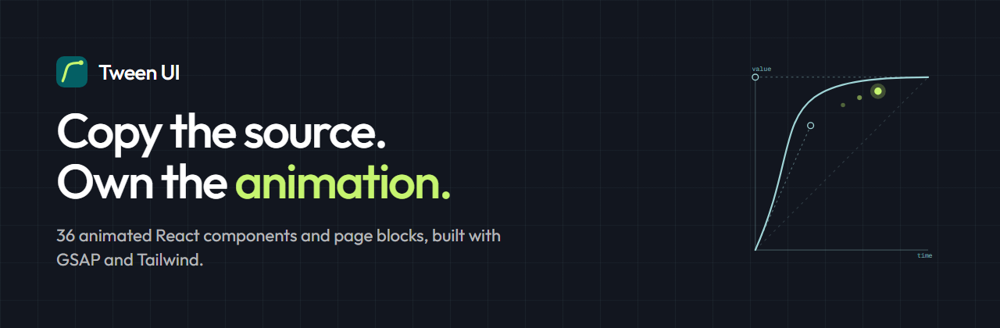

<p align="center">
  
</p>

<p align="center">
  <a href="https://tween-ui.vercel.app"><strong>Documentation</strong></a> ·
  <a href="https://tween-ui.vercel.app/components"><strong>Components</strong></a> ·
  <a href="CONTRIBUTING.md"><strong>Contributing</strong></a>
</p>

---

# Tween UI

Animated React components built with [GSAP](https://gsap.com) and Tailwind CSS.
**36 of them** — 16 components and 20 page-level blocks.

There is no package to install. The CLI copies a component's entire `.tsx` file
into your project, and from that moment it is your code: rename it, restyle it,
delete half of it. Nothing upstream can break it later.

## Why this exists

Animation libraries give you 80% of what you want and an API to fight over the
last 20%. Tween UI takes the [shadcn/ui](https://ui.shadcn.com) approach
instead — you own the source, so changing a duration means opening the file and
changing the number.

Three decisions follow from that:

**One file per component.** No shared runtime, no theme provider, no config to
set up. A component that needs `@theme` tokens ships them with itself.

**GSAP only where it earns its place.** Timelines, ScrollTrigger and SplitText
drive the sequenced work. Anything a CSS transition can handle stays a CSS
transition — several components pull in no animation library at all.

**Reduced motion in every component.** All 36 respect
`prefers-reduced-motion` — 29 check it in JavaScript and skip the timeline
entirely, the rest handle it in CSS — and each one renders its finished state
rather than animating. It was in from the first component, not patched in after
someone filed an issue.

## Quick start

Add any component with the [shadcn CLI](https://ui.shadcn.com/docs/cli):

```bash
pnpm dlx shadcn@latest add https://tween-ui.vercel.app/r/sliding-tabs.json
```

That writes `components/tweenui/sliding-tabs.tsx` into your project. Use it like
any local component:

```tsx
import SlidingTabs from '@/components/tweenui/sliding-tabs';

const items = [
  { value: 'home', label: 'Home' },
  { value: 'about', label: 'About' },
  { value: 'work', label: 'Work' },
];

export default function Page() {
  return <SlidingTabs items={items} defaultValue="home" />;
}
```

Every component's page has an install tab, the full source, its props table and
an accessibility note describing exactly what happens under reduced motion.

## What's inside

**16 components** — buttons (icon trail, shiny, text roll, slide arrow, glow),
sliding tabs, FAQ accordion, flip card, auth modal, number counter, avatar
reveal, voice sample player, image fan slider, and three logo treatments
(orbit, cycle, wave).

**20 blocks** — heroes, pricing sections, testimonial sliders, process steps,
CTAs, team collages, project grids and integration diagrams. Blocks are
page-level sections; some are built from the components above.

Browse them all at **[tween-ui.vercel.app/components](https://tween-ui.vercel.app/components)**.

## Requirements

| | |
| --- | --- |
| React | 19 |
| Tailwind CSS | v4 |
| GSAP | 3.13+ (only for components that use it) |
| TypeScript | 5.x |

GSAP 3.13 made SplitText and DrawSVG free, which is what makes several of these
components possible without a Club GreenSock licence.

## Repository

A Turborepo + pnpm workspace. Everything currently lives in `apps/docs`, which
is both the documentation site and the registry that the CLI reads.

```
apps/docs/
├─ registry/
│  ├─ registry-ui.ts       component entries
│  ├─ registry-blocks.ts   block entries
│  ├─ tweenui/<name>.tsx   the shippable source — what the CLI copies
│  └─ demos/<name>.tsx     what the docs preview renders
├─ content/
│  ├─ 1.component/<name>.mdx
│  └─ 2.block/<name>.mdx
├─ public/r/*.json         generated — the shadcn registry items
└─ scripts/build-registry.ts
```

One component is one name at every layer. `WORKFLOW.md` has the full
architecture and the phase history.

```bash
pnpm install
pnpm dev              # docs at http://localhost:3000
pnpm registry:build   # regenerate public/r/*.json and the generated modules
pnpm test             # vitest — registry integrity + per-component render
pnpm typecheck
```

## Contributing

New components, fixes and documentation are all welcome — see
[CONTRIBUTING.md](CONTRIBUTING.md) for the setup, the anatomy of a component and
the checks CI runs.

## License

[MIT](LICENSE) © StaticMania

Documentation built with [Docora](https://github.com/StaticMania/docora).
